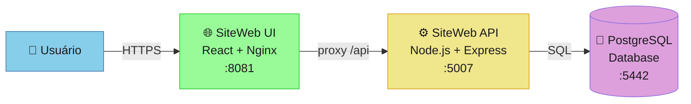

# 📚 Documentação Técnica - SiteWeb

> **Versão 2.0** - Documentação completa seguindo padrões enterprise (Global Rules v12.0)

## 🎯 Visão Geral do projeto aula devops

**SiteWeb** é uma aplicação web moderna para **captura e gestão de leads** sobre DevOps, construída com arquitetura de 3 camadas:

- **Frontend**: React 19 + Vite (SPA moderna)
- **Backend**: Node.js 20 LTS + Express (API RESTful)
- **Database**: PostgreSQL 16 (dados estruturados)
- **Deploy**: Docker Compose (ambientes locais e de desenvolvimento)

### Objetivos do Projeto
1. Capturar leads qualificados sobre interesse em DevOps
2. Fornecer conteúdo educacional sobre práticas DevOps
3. Demonstrar arquitetura moderna cloud-native
4. Servir como template para projetos similares

### Métricas de Sucesso
- **Performance**: API response time < 200ms (p95)
- **Disponibilidade**: Uptime ≥ 99.9%
- **Qualidade**: Zero bugs críticos em produção
- **UX**: Formulário de leads com submit < 1s

---

## 📂 Estrutura da Documentação

### 🏗️ **Arquitetura**
```
/architecture/
├── c4-model/                 # Diagramas C4 (4 níveis)
│   ├── 01-system-context/   # Visão externa do sistema
│   ├── 02-containers/       # Aplicações e serviços
│   ├── 03-components/       # Estrutura interna
│   └── 04-code/            # Classes críticas (opcional)
├── adr/                     # Architecture Decision Records
│   ├── 0001-stack-node-react.md
│   ├── 0002-postgresql-database.md
│   └── 0003-docker-deployment.md
└── steering/                # Governança do projeto
    ├── PRD.md              # Product Requirements
    ├── TECH_SPEC.md        # Especificação técnica
    ├── PROJECT_CHARTER.md  # Autorização e escopo
    └── GOVERNANCE.md       # Processos e qualidade
```

### 🔄 **Fluxos e Regras**
```
/flows/                      # Fluxos de negócio
└── leads-flow-v2.md        # Cadastro de leads

/business-rules/            # Regras de domínio
└── leads-v2.md            # Validações e políticas
```

### 🚀 **Deploy e Operação**
```
/deployment/                # Guias de implantação
├── development-v2.md      # Ambiente local
├── staging-v1.md          # Ambiente de testes
└── production-v1.md       # Produção (planejado)

/runbooks/                 # Procedimentos operacionais
└── incident-response.md   # Gestão de incidentes
```

### 📦 **Código e Estrutura**
```
/codebase/                 # Inventário de código
└── files-overview-v2.md  # Catálogo atualizado

/templates/               # Templates reutilizáveis
├── adr-template.md
├── gap-analysis-template.md
└── migration-plan-template.md
```

---

## 🚀 Navegação Rápida

### Para Desenvolvedores
- 📖 [System Context (C4 L1)](/architecture/c4-model/01-system-context/overview-v2.md) - Visão geral do sistema
- 🏗️ [Containers (C4 L2)](/architecture/c4-model/02-containers/siteweb-containers-v2.md) - Arquitetura de serviços
- ⚙️ [Components API (C4 L3)](/architecture/c4-model/03-components/siteweb-api-components-v2.md) - Estrutura interna da API
- 🎨 [Components UI (C4 L3)](/architecture/c4-model/03-components/siteweb-ui-components-v2.md) - Estrutura interna do frontend
- 🔄 [Fluxo de Leads](/flows/leads-flow-v2.md) - Jornada de cadastro
- 📋 [Catálogo de Arquivos](/codebase/files-overview-v2.md) - Inventário completo

### Para Arquitetos
- 🏛️ [ADRs - Decisões Arquiteturais](/architecture/adr/) - Histórico de decisões
- 📊 [Steering Documents](/architecture/steering/) - Governança e planejamento
- 📐 [Tech Spec](/architecture/steering/TECH_SPEC.md) - Especificação técnica completa

### Para DevOps/SRE
- 🚀 [Deploy Development](/deployment/development-v2.md) - Setup local
- 📈 [Observabilidade](#observabilidade) - Logs, métricas, traces (planejado)
- 🔒 [Segurança](#segurança) - Políticas e compliance (planejado)

### Para Product Owners
- 📄 [PRD - Product Requirements](/architecture/steering/PRD.md) - Requisitos e objetivos
- 🎯 [Business Rules - Leads](/business-rules/leads-v2.md) - Regras de negócio
- 📊 [Métricas de Sucesso](#métricas-de-sucesso) - KPIs e monitoramento

---

## 🏗️ Arquitetura - Visão Resumida



---

## 📊 Stack Tecnológico

### Frontend
| Tecnologia | Versão | Propósito |
|-----------|--------|-----------|
| React | 19.2.0 | Framework UI |
| Vite | 7.2.2 | Build tool e dev server |
| Nginx | 1.27-alpine | Web server e proxy reverso |

### Backend
| Tecnologia | Versão | Propósito |
|-----------|--------|-----------|
| Node.js | 20.x LTS | Runtime JavaScript |
| Express | 4.19.2 | Framework web |
| pg | 8.12.0 | Client PostgreSQL |
| cors | 2.8.5 | Middleware CORS |

### Database & Infra
| Tecnologia | Versão | Propósito |
|-----------|--------|-----------|
| PostgreSQL | 16-alpine | Banco de dados relacional |
| Docker | 24+ | Containerização |
| Docker Compose | 2.x | Orquestração local |

---

## 🚦 Status do Projeto

### ✅ Implementado
- [x] Arquitetura básica UI/API/DB
- [x] Formulário de captura de leads
- [x] API RESTful com validações
- [x] Persistência PostgreSQL
- [x] Docker Compose para desenvolvimento
- [x] Documentação C4 Model completa

### 🚧 Em Desenvolvimento
- [ ] Testes automatizados (unit, integration, e2e)
- [ ] CI/CD pipeline (GitHub Actions)
- [ ] Observabilidade (logs estruturados, métricas)
- [ ] Health checks e readiness probes
- [ ] Rate limiting e segurança avançada

### 📋 Planejado
- [ ] Ambiente de staging
- [ ] Deploy em produção (AWS/Azure)
- [ ] Painel administrativo de leads
- [ ] Integração com CRM
- [ ] Analytics e dashboards

---

## 🔗 Links Importantes

### Repositórios
- **Código Fonte**: `/Users/arthursilva/Documents/SiteDev/`
- **Docker Hub**: `arthursilvaalest/sitewebapi` | `arthursilvaalest/sitewebui`

### Documentação Externa
- [React Documentation](https://react.dev/)
- [Node.js Best Practices](https://github.com/goldbergyoni/nodebestpractices)
- [PostgreSQL Documentation](https://www.postgresql.org/docs/)
- [C4 Model](https://c4model.com/)
- [Global Rules v12.0](../GLOBAL_RULES.md) - Padrões internos

### Ferramentas
- [Mermaid Live Editor](https://mermaid.live/) - Para editar diagramas
- [Docker Hub](https://hub.docker.com/) - Registro de imagens

---

## 📝 Convenções de Documentação

### Metadados Obrigatórios
Todos os documentos devem incluir header YAML com:
```yaml
---
title: "[Título do Documento]"
version: "vX.Y"
date: "YYYY-MM-DD"
author: "[Nome]"
reviewer: "[Nome]"
status: "draft|review|approved|deprecated"
last_updated: "YYYY-MM-DD"
related_code: "[paths relevantes]"
---
```

### Versionamento
- **v1.x**: Versão inicial (legada)
- **v2.x**: Reescrita seguindo Global Rules v12.0
- **Major version**: Mudanças significativas de estrutura
- **Minor version**: Atualizações e correções

### Responsabilidades
- **Arquiteto de Solução**: Aprova mudanças arquiteturais
- **Tech Lead**: Mantém documentação técnica atualizada
- **Desenvolvedores**: Atualizam docs junto com código
- **Product Owner**: Valida regras de negócio

---

## 🤝 Como Contribuir

### Atualizando Documentação
1. Sempre incluir metadados completos (YAML header)
2. Seguir convenções de nomenclatura (Seção 4.1.4 Global Rules)
3. Validar diagramas Mermaid antes de commit
4. Atualizar `last_updated` e incrementar versão quando aplicável
5. Referenciar código relacionado em `related_code`

### Criando Novos ADRs
Use o template: `/templates/adr-template.md`

### Reportando Problemas
- Issues de documentação: adicionar label `documentation`
- Sugestões de melhoria: adicionar label `enhancement`

---

## 📞 Contatos

### Equipe Técnica
- **Tech Lead**: Arthur Silva
- **Arquiteto**: Equipe Alest EVC
- **DevOps**: [A definir]

### Canais de Comunicação
- **Slack**: #siteweb-dev
- **Email**: siteweb-team@alest.com.br
- **Confluence**: [Link para página do projeto]

---

## 📚 Histórico de Versões

| Versão | Data | Autor | Mudanças |
|--------|------|-------|----------|
| v2.0 | 2025-01-15 | Equipe Alest | Reestruturação completa seguindo Global Rules v12.0 |
| v1.0 | 2025-11-12 | Equipe Alest | Documentação inicial |

---

**📌 Nota**: Esta documentação segue rigorosamente os padrões definidos no **Global Rules v12.0** (Seções 3, 4, 33, 81).
