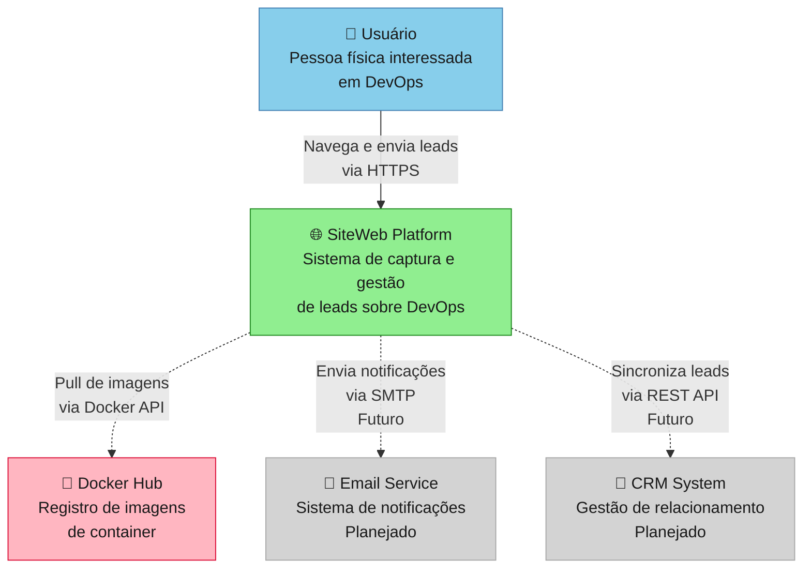

# C4 Model - Nível 1: System Context

> **Audiência**: Stakeholders, Product Owners, Arquitetos de Solução  
> **Objetivo**: Visão geral do sistema e suas interações com usuários e sistemas externos  
> **Última revisão**: 2025-01-15

---

## 📊 Diagrama de Contexto



---

## 📝 Descrição dos Elementos

### 👤 Usuários

#### **Usuário (Pessoa Física)**
- **Tipo**: Pessoa/Ator
- **Descrição**: Profissional de tecnologia interessado em aprender sobre DevOps
- **Interação**: Acessa a plataforma via navegador web para consumir conteúdo e enviar informações de contato
- **Requisitos**:
  - Navegador moderno (Chrome 90+, Firefox 88+, Safari 14+, Edge 90+)
  - Conexão internet estável
  - Sem necessidade de autenticação (público)

---

### 🌐 Sistema Principal

#### **SiteWeb Platform**
- **Tipo**: Sistema Principal
- **Propósito**: Educar usuários sobre DevOps e capturar leads qualificados
- **Tecnologias**: React 19 (frontend) + Node.js 20 (backend) + PostgreSQL 16 (database)
- **Responsabilidades**:
  - ✅ Servir conteúdo educacional sobre DevOps
  - ✅ Capturar e validar dados de leads
  - ✅ Persistir informações no banco de dados
  - ✅ Fornecer API RESTful para operações
- **Deployment**: Docker Compose (desenvolvimento), planejado para AWS/Azure (produção)
- **SLA Alvo**: 99.9% uptime, < 200ms response time (p95)

---

### 🔗 Sistemas Externos

#### **Docker Hub** (Em Uso)
- **Tipo**: Sistema Externo - Registro de Containers
- **Propósito**: Armazenar e distribuir imagens Docker da aplicação
- **Interação**: 
  - CI/CD faz push de novas imagens após build
  - Ambientes fazem pull das imagens para deploy
- **Imagens Publicadas**:
  - `arthursilvaalest/sitewebapi:latest` (Backend API)
  - `arthursilvaalest/sitewebui:latest` (Frontend UI)
- **Protocolo**: Docker Registry API v2
- **SLA**: 99.9% (fornecido por Docker Inc.)

#### **Email Service** (Planejado - Futuro)
- **Tipo**: Sistema Externo - Notificações
- **Propósito**: Enviar emails transacionais e notificações
- **Casos de Uso Planejados**:
  - Confirmação de cadastro de lead
  - Notificação para equipe de vendas
  - Campanhas de nutrição de leads
- **Candidatos**: SendGrid, AWS SES, Mailgun
- **Protocolo**: SMTP / REST API
- **Implementação**: Q2 2025

#### **CRM System** (Planejado - Futuro)
- **Tipo**: Sistema Externo - Gestão de Relacionamento
- **Propósito**: Centralizar gestão de leads e pipeline de vendas
- **Casos de Uso Planejados**:
  - Sincronização automática de novos leads
  - Enriquecimento de dados de contatos
  - Tracking de conversões
- **Candidatos**: HubSpot, Salesforce, Pipedrive
- **Protocolo**: REST API com webhooks
- **Implementação**: Q3 2025

---

## 🔄 Fluxos Principais

### 1️⃣ Cadastro de Lead (Implementado)
```
Usuário → Preenche formulário → SiteWeb valida → 
Persiste no PostgreSQL → Retorna confirmação → Usuário
```

### 2️⃣ Deploy da Aplicação (Implementado)
```
CI/CD → Build imagens → Push para Docker Hub → 
Ambiente → Pull de imagens → Deploy containers
```

### 3️⃣ Notificação de Lead (Planejado)
```
Novo lead cadastrado → SiteWeb → Email Service → 
Envia email para equipe → Log de notificação
```

### 4️⃣ Sincronização com CRM (Planejado)
```
Novo lead cadastrado → SiteWeb → CRM System → 
Cria/atualiza contato → Webhook de confirmação → SiteWeb
```

---

## 🔒 Segurança e Compliance

### Autenticação e Autorização
- **Usuários**: Sem autenticação (acesso público ao conteúdo)
- **APIs Externas**: Autenticação via API keys armazenadas em secrets
- **Futuro**: Implementar OAuth 2.0 para painel administrativo

### Proteção de Dados
- **LGPD/GDPR Compliance**: 
  - ✅ Coleta apenas dados necessários (nome, email, área, comentário)
  - ✅ Transparência sobre uso dos dados (termos de uso)
  - 🚧 Implementar consentimento explícito
  - 🚧 Funcionalidade de exclusão de dados (direito ao esquecimento)
- **Criptografia**: 
  - ✅ TLS 1.3 em trânsito
  - 🚧 Criptografia em repouso (PostgreSQL)

### Rate Limiting
- 🚧 **Planejado**: 100 requests/15min por IP
- 🚧 **Proteção**: CAPTCHA após 3 submissões rápidas

---

## 📈 Escalabilidade e Performance

### Capacidade Atual
- **Usuários Simultâneos**: ~100 (suficiente para MVP)
- **Throughput API**: ~50 req/s
- **Database Connections**: Pool de 10 conexões

### Plano de Escalabilidade
1. **Fase 1** (MVP): Docker Compose em VM única
2. **Fase 2** (Crescimento): Kubernetes com HPA (Horizontal Pod Autoscaling)
3. **Fase 3** (Produção): Multi-região com CDN e cache distribuído

---

## 🎯 Métricas e Monitoramento

### SLIs (Service Level Indicators)
- **Disponibilidade**: % de requests com status 2xx/3xx
- **Latência**: p50, p95, p99 de tempo de resposta
- **Taxa de Erro**: % de requests com status 5xx

### SLOs (Service Level Objectives)
- **Disponibilidade**: ≥ 99.9% em janela de 30 dias
- **Latência p95**: ≤ 200ms para GET, ≤ 500ms para POST
- **Taxa de Erro**: ≤ 0.1% de requests falhando

### Alertas (Planejado)
- 🚧 Disponibilidade < 99.5% em 1h
- 🚧 Latência p95 > 300ms por 5 minutos
- 🚧 Taxa de erro > 1% por 5 minutos

---

## 📋 Dependências Externas

| Sistema | Status | Criticidade | Fallback |
|---------|--------|-------------|----------|
| Docker Hub | ✅ Ativo | Alta | Cache local de imagens |
| PostgreSQL | ✅ Ativo | Crítica | Backup diário |
| Email Service | 🚧 Planejado | Média | Fila de retry + logs |
| CRM System | 🚧 Planejado | Baixa | Sincronização assíncrona |

---

## 🔄 Histórico de Mudanças

| Versão | Data | Autor | Mudanças |
|--------|------|-------|----------|
| v2.0 | 2025-01-15 | Equipe Alest | Reescrita completa seguindo Global Rules v12.0 (Seção 4.1) |
| v1.0 | 2025-11-12 | Equipe Alest | Versão inicial do diagrama |

---

## 📚 Referências

### Documentação Relacionada
- [C4 Level 2 - Containers](/architecture/c4-model/02-containers/siteweb-containers-v2.md)
- [ADR-0001: Escolha de Stack](/architecture/adr/0001-stack-node-react.md)
- [Product Requirements Document](/architecture/steering/PRD.md)
- [Technical Specification](/architecture/steering/TECH_SPEC.md)

### Padrões e Guidelines
- [C4 Model Official](https://c4model.com/)
- [Global Rules v12.0 - Seção 4.1 (C4 Model)](../../GLOBAL_RULES.md#41-c4-model)
- [Global Rules v12.0 - Seção 3.1 (Diagrams as Code)](../../GLOBAL_RULES.md#31-diagrams-as-code)

---

## 🤝 Responsabilidades

### Ownership
- **Owner**: Arquiteto de Solução + Product Owner
- **Frequência de Revisão**: Trimestral ou quando há mudanças de negócio significativas
- **Critérios de Atualização**: 
  - Novos sistemas externos integrados
  - Mudanças de personas ou segmentos de usuários
  - Alterações significativas de escopo do sistema

### Aprovação de Mudanças
- Mudanças neste diagrama requerem aprovação de:
  - ✅ Arquiteto de Solução (validação técnica)
  - ✅ Product Owner (alinhamento com negócio)
  - ✅ Tech Lead (viabilidade de implementação)

---

**📌 Nota**: Este diagrama segue as convenções da **Seção 4.1 (C4 Model)** e **Seção 3.1 (Diagrams as Code)** das Global Rules v12.0.

