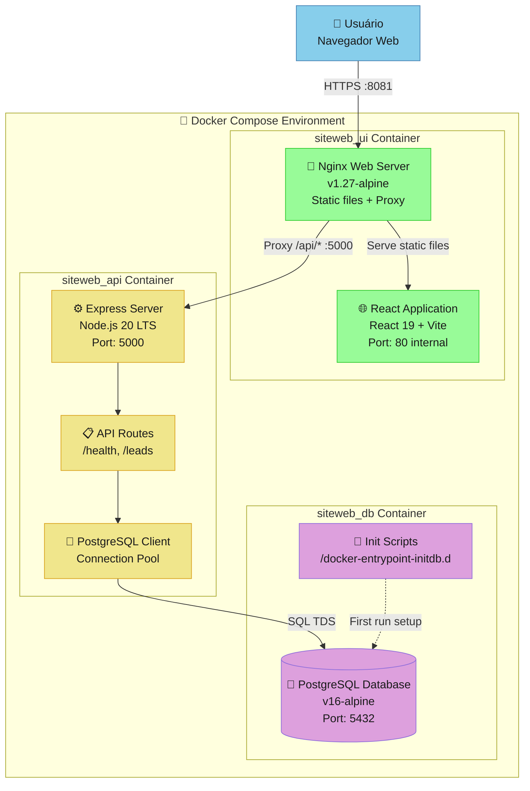
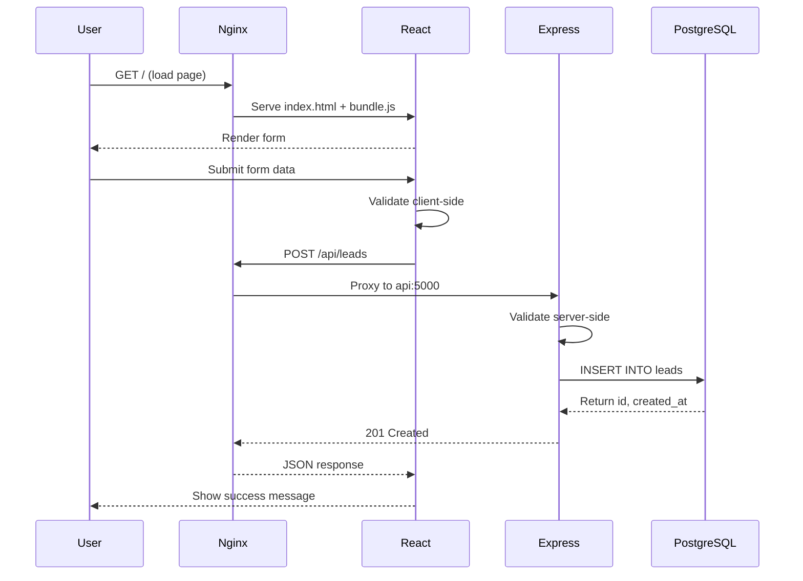
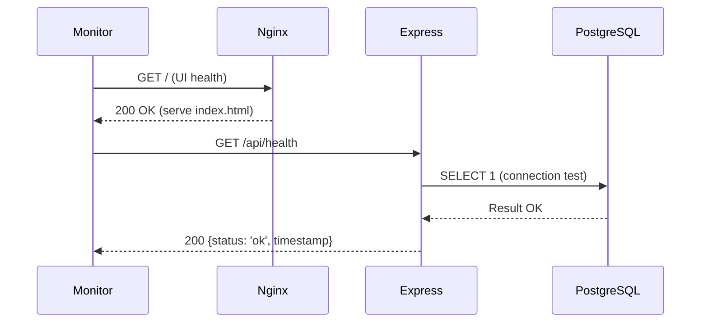

# C4 Model - Nível 2: Containers

> **Audiência**: Arquitetos, Tech Leads, Desenvolvedores Sênior  
> **Objetivo**: Decomposição do sistema em contêineres executáveis (aplicações, bancos, serviços)  
> **Última revisão**: 2025-01-15

---

## 📊 Diagrama de Contêineres



---

## 📦 Descrição dos Contêineres

### 🌐 siteweb_ui (Frontend Container)

#### **Propósito**
Servir a Single Page Application (SPA) e atuar como proxy reverso para a API backend.

#### **Tecnologias**
- **Runtime**: Nginx 1.27-alpine
- **Build Tool**: Vite 7.2.2
- **Framework**: React 19.2.0
- **Linguagem**: JavaScript (ES2022)

#### **Componentes Internos**

##### React Application
- **Responsabilidade**: Interface do usuário interativa
- **Funcionalidades**:
  - ✅ Renderização do conteúdo educacional sobre DevOps
  - ✅ Formulário de captura de leads com validações client-side
  - ✅ Estados de loading, sucesso e erro
  - ✅ Responsividade mobile-first
- **Build Output**: `/usr/share/nginx/html` (static files)

##### Nginx Web Server
- **Responsabilidade**: Servir assets estáticos e rotear requisições API
- **Configuração**:
  ```nginx
  location / {
    try_files $uri /index.html;  # SPA fallback
  }
  
  location /api/ {
    proxy_pass http://api:5000;  # Proxy para backend
    proxy_http_version 1.1;
  }
  ```
- **Headers de Segurança**: 
  - ✅ `X-Content-Type-Options: nosniff`
  - 🚧 CSP (Content Security Policy) - planejado
  - 🚧 HSTS (HTTP Strict Transport Security) - planejado

#### **Portas e Networking**
- **External**: `8081` (host) → `80` (container)
- **Internal**: Comunica com `api:5000` via Docker network
- **Protocol**: HTTP (desenvolvimento), HTTPS (produção)

#### **Volumes**
- `./SiteWebUI/nginx.conf:/etc/nginx/conf.d/default.conf:ro` (read-only)

#### **Health Check** (Planejado)
```yaml
healthcheck:
  test: ["CMD", "wget", "--quiet", "--tries=1", "--spider", "http://localhost:80/"]
  interval: 30s
  timeout: 3s
  retries: 3
  start_period: 10s
```

---

### ⚙️ siteweb_api (Backend Container)

#### **Propósito**
Processar requisições HTTP, validar dados de negócio e persistir informações no banco de dados.

#### **Tecnologias**
- **Runtime**: Node.js 20.x LTS (alpine)
- **Framework**: Express 4.19.2
- **Client DB**: pg 8.12.0 (node-postgres)
- **Middlewares**: cors, express.json()

#### **Componentes Internos**

##### Express Server
- **Responsabilidade**: Gerenciar ciclo de vida da aplicação
- **Configuração**:
  - CORS configurado para `CLIENT_URL` (ambiente)
  - Body parser JSON (limite padrão 100kb)
  - Error handling middleware
  - Request logging (planejado: winston)

##### API Routes
- **Endpoints Disponíveis**:
  - `GET /api/health` → Status e timestamp
  - `POST /api/leads` → Cadastro de novo lead
- **Validações**:
  - ✅ Campos obrigatórios (nome, email, area)
  - ✅ Formato de email (regex)
  - ✅ Sanitização de inputs
  - 🚧 Rate limiting (planejado)

##### PostgreSQL Client
- **Responsabilidade**: Gerenciar conexões com banco de dados
- **Connection Pool**:
  - Max connections: 10
  - Idle timeout: 30s
  - Connection timeout: 10s
- **Retry Logic**: 🚧 Planejado (3 tentativas, backoff exponencial)

#### **Variáveis de Ambiente**
```bash
PORT=5000                              # Porta do servidor
CLIENT_URL=http://localhost:8081      # CORS origin
PGHOST=db                              # Database host
PGPORT=5432                            # Database port
PGUSER=postgres                        # Database user
PGPASSWORD=senha123                    # ⚠️ Usar secrets em prod
PGDATABASE=siteweb                     # Database name
LOG_LEVEL=info                         # Nível de log (planejado)
```

#### **Portas e Networking**
- **External**: `5007` (host) → `5000` (container) - debug apenas
- **Internal**: `5000` (acessível via `api:5000` na rede Docker)
- **Protocol**: HTTP (REST API)

#### **Dependencies**
- Requer `siteweb_db` estar saudável antes de iniciar
- Configurado via `depends_on` no docker-compose

#### **Health Check**
```yaml
healthcheck:
  test: ["CMD", "node", "-e", "require('http').get('http://localhost:5000/api/health')"]
  interval: 30s
  timeout: 3s
  retries: 3
  start_period: 15s
```

---

### 💾 siteweb_db (Database Container)

#### **Propósito**
Persistir dados estruturados de leads e fornecer capacidades de query transacional.

#### **Tecnologias**
- **RDBMS**: PostgreSQL 16-alpine
- **Storage Engine**: PostgreSQL native (MVCC)
- **Collation**: pt_BR.UTF-8

#### **Componentes Internos**

##### PostgreSQL Database
- **Responsabilidade**: Armazenamento ACID de dados
- **Schema Principal**: `public`
- **Tabelas**:
  - `leads` (id, nome, email, area, comentario, created_at)
- **Índices**:
  - Primary Key: `leads_pkey` (id)
  - Index: `idx_leads_email` (email) - para queries de duplicação
- **Constraints**:
  - `NOT NULL`: nome, email, area
  - `UNIQUE`: email (índice único)

##### Init Scripts
- **Responsabilidade**: Criar schema inicial automaticamente
- **Localização**: `/docker-entrypoint-initdb.d` (executado em ordem alfabética)
- **Scripts**:
  - `001_create_leads.sql` → Cria tabela leads e índices
- **Idempotência**: Usa `CREATE TABLE IF NOT EXISTS`

#### **Variáveis de Ambiente**
```bash
POSTGRES_USER=postgres        # Superuser
POSTGRES_PASSWORD=senha123    # ⚠️ Usar secrets em prod
POSTGRES_DB=siteweb           # Database padrão
```

#### **Portas e Networking**
- **External**: `5442` (host) → `5432` (container) - acesso direto para debug
- **Internal**: `5432` (acessível via `db:5432` na rede Docker)
- **Protocol**: PostgreSQL Wire Protocol (TDS)

#### **Volumes**
- **Data**: `pgdata_compose:/var/lib/postgresql/data` (persistência)
- **Init Scripts**: `./SiteWebAPI/sql:/docker-entrypoint-initdb.d:ro` (read-only)

#### **Backup Strategy** (Planejado)
- 🚧 Backup diário via pg_dump
- 🚧 Retenção: 7 dias (local), 30 dias (S3/Azure Blob)
- 🚧 Teste de restore semanal

#### **Health Check**
```yaml
healthcheck:
  test: ["CMD", "pg_isready", "-U", "postgres", "-d", "siteweb"]
  interval: 10s
  timeout: 3s
  retries: 3
  start_period: 20s
```

---

## 🔄 Fluxos de Comunicação

### 1️⃣ Cadastro de Lead (Happy Path)



### 2️⃣ Health Check Flow



---

## 🔒 Segurança

### Network Isolation
- **Default Bridge Network**: Todos os containers na mesma rede interna
- **External Access**: Apenas portas mapeadas (8081, 5007, 5442)
- **Planejado**: Custom network com isolation entre UI/API/DB

### Secrets Management
- ⚠️ **Atual**: Secrets em docker-compose.yml (dev apenas)
- 🚧 **Planejado**: Docker Secrets ou Vault para staging/prod
- 🚧 **Planejado**: Rotação automática de passwords

### CORS Policy
- **Atual**: Permissivo para `CLIENT_URL` configurável
- **Planejado**: Whitelist de domínios por ambiente

---

## 📈 Performance e Escalabilidade

### Resource Limits (Planejado)
```yaml
api:
  deploy:
    resources:
      limits:
        cpus: '0.5'
        memory: 512M
      reservations:
        cpus: '0.25'
        memory: 256M
```

### Scaling Strategy
- **Fase 1 (MVP)**: Single instance de cada container
- **Fase 2 (Staging)**: API horizontal scaling (2-3 replicas)
- **Fase 3 (Produção)**: Kubernetes HPA baseado em CPU/Memory/Latência

---

## 🔄 Deployment Pipeline

### Build Process
```bash
# UI
cd SiteWebUI
npm ci
npm run build              # → dist/
docker build -t sitewebui .

# API  
cd SiteWebAPI
docker build -t sitewebapi .

# Push to registry
docker tag sitewebui arthursilvaalest/sitewebui:latest
docker push arthursilvaalest/sitewebui:latest
```

### Environment-Specific Configuration
| Environment | UI Port | API Port | DB Port | CORS |
|-------------|---------|----------|---------|------|
| Local Dev   | 8081    | 5007     | 5442    | * |
| Staging     | 443     | Internal | Internal | staging.siteweb.com |
| Production  | 443     | Internal | Internal | www.siteweb.com |

---

## 📊 Métricas por Container

### UI Container
- **Metrics** (Planejado):
  - Request rate (req/s)
  - Response time p95
  - Static cache hit ratio
  - Bandwidth usage

### API Container
- **Metrics** (Planejado):
  - Request rate (req/s)
  - Response time p50/p95/p99
  - Error rate (%)
  - Active connections

### DB Container
- **Metrics** (Planejado):
  - Active connections
  - Query duration p95
  - Cache hit ratio
  - Disk usage

---

## 🔄 Histórico de Mudanças

| Versão | Data | Autor | Mudanças |
|--------|------|-------|----------|
| v2.0 | 2025-01-15 | Equipe Alest | Reescrita completa seguindo Global Rules v12.0 (Seção 4.1); adicionadas health checks, métricas e diagrama de sequência |
| v1.0 | 2025-11-12 | Equipe Alest | Versão inicial do diagrama de containers |

---

## 📚 Referências

### Documentação Relacionada
- [C4 Level 1 - System Context](/architecture/c4-model/01-system-context/overview-v2.md)
- [C4 Level 3 - API Components](/architecture/c4-model/03-components/siteweb-api-components-v2.md)
- [C4 Level 3 - UI Components](/architecture/c4-model/03-components/siteweb-ui-components-v2.md)
- [ADR-0003: Docker Deployment Strategy](/architecture/adr/0003-docker-deployment.md)

### Código Relacionado
- `docker-compose.yml` - Orquestração de containers
- `SiteWebUI/nginx.conf` - Configuração Nginx
- `SiteWebAPI/src/server.js` - Setup do Express
- `SiteWebAPI/sql/001_create_leads.sql` - Init script DB

### Padrões e Guidelines
- [Docker Best Practices](https://docs.docker.com/develop/dev-best-practices/)
- [Nginx Configuration Guide](https://nginx.org/en/docs/)
- [PostgreSQL Docker Hub](https://hub.docker.com/_/postgres)
- [Global Rules v12.0 - Seção 4.1.2 (Container Level)](../../GLOBAL_RULES.md#412-c4-containers)

---

## 🤝 Responsabilidades

### Ownership
- **Owner**: Tech Lead + Arquiteto de Software
- **Frequência de Revisão**: Mensal ou a cada release major
- **Critérios de Atualização**: 
  - Novos serviços ou containers adicionados
  - Mudanças de tecnologia (ex: versão Node.js)
  - Alterações significativas de deployment

### Aprovação de Mudanças
- Mudanças neste diagrama requerem aprovação de:
  - ✅ Tech Lead (validação técnica e viabilidade)
  - ✅ Arquiteto de Software (alinhamento arquitetural)
  - ✅ DevOps Engineer (impacto em deployment)

---

**📌 Nota**: Este diagrama segue as convenções da **Seção 4.1.2 (C4 Containers)** e **Seção 4.1.6 (Nomenclatura e Cores)** das Global Rules v12.0.

