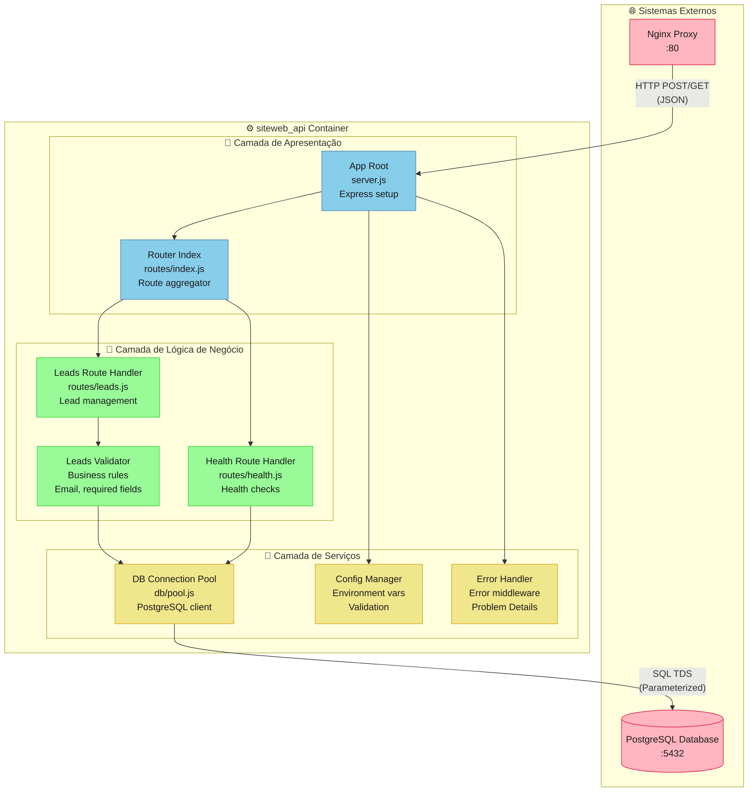
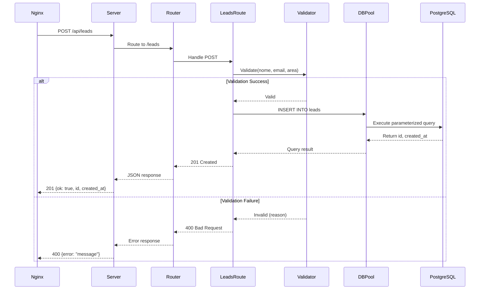
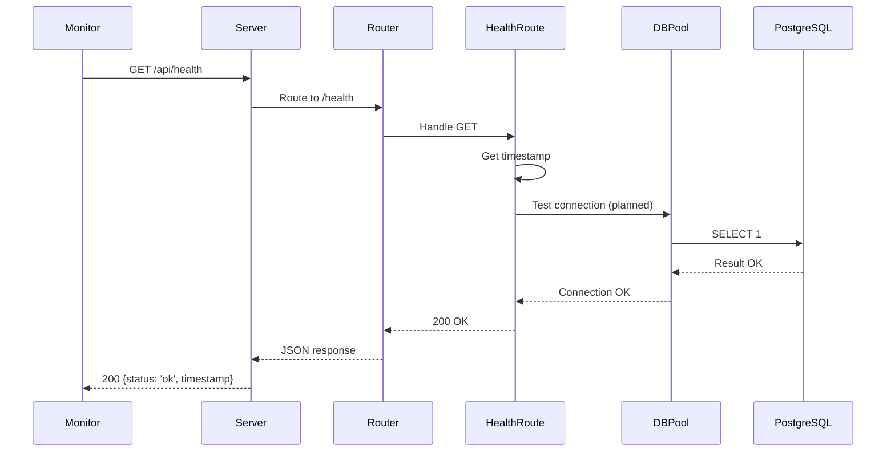

# C4 Model - Nível 3: Components - API

> **Audiência**: Desenvolvedores, Arquitetos de Software  
> **Objetivo**: Estrutura interna do container siteweb_api (componentes e interações)  
> **Última revisão**: 2025-01-15

---

## 📊 Diagrama de Componentes



---

## 🧩 Descrição dos Componentes

### 📱 **Camada de Apresentação**

#### **App Root (server.js)**
- **Tipo**: Entry Point
- **Responsabilidades**:
  - ✅ Inicializar aplicação Express
  - ✅ Configurar middlewares globais (CORS, JSON parser)
  - ✅ Registrar rotas via Router
  - ✅ Configurar error handling middleware
  - ✅ Iniciar servidor HTTP na porta configurada
- **Dependências**:
  - `express` (4.19.2)
  - `cors` (2.8.5)
  - `dotenv` (16.4.5)
- **Configurações**:
  ```javascript
  PORT: process.env.PORT || 5000
  CLIENT_URL: process.env.CLIENT_URL || 'http://localhost:5173'
  ```
- **Código Referência**: `SiteWebAPI/src/server.js`

#### **Router Index (routes/index.js)**
- **Tipo**: Aggregator
- **Responsabilidades**:
  - ✅ Agregar todas as rotas da aplicação
  - ✅ Aplicar prefixo `/api` para versionamento
  - ✅ Organizar rotas por domínio (health, leads, etc.)
- **Rotas Registradas**:
  - `/api/health` → HealthRoute
  - `/api/leads` → LeadsRoute
- **Padrão**: Route composition pattern
- **Código Referência**: `SiteWebAPI/src/routes/index.js`

---

### 💼 **Camada de Lógica de Negócio**

#### **Health Route Handler (routes/health.js)**
- **Tipo**: Route Handler
- **Endpoint**: `GET /api/health`
- **Responsabilidades**:
  - ✅ Retornar status da API
  - ✅ Verificar conectividade com dependências (planejado)
  - ✅ Fornecer timestamp para sincronização
- **Response Schema**:
  ```json
  {
    "status": "ok",
    "timestamp": "2025-01-15T10:30:00.000Z"
  }
  ```
- **SLA**: < 50ms response time
- **Código Referência**: `SiteWebAPI/src/routes/health.js`

#### **Leads Route Handler (routes/leads.js)**
- **Tipo**: Route Handler
- **Endpoint**: `POST /api/leads`
- **Responsabilidades**:
  - ✅ Receber dados de lead via JSON body
  - ✅ Validar dados via LeadsValidator
  - ✅ Persistir no banco via DBPool
  - ✅ Retornar resposta padronizada
- **Request Schema**:
  ```json
  {
    "nome": "string (required)",
    "email": "string (required, email format)",
    "area": "string (required)",
    "comentario": "string (optional)"
  }
  ```
- **Response Schema** (Sucesso):
  ```json
  {
    "ok": true,
    "id": 123,
    "created_at": "2025-01-15T10:30:00.000Z"
  }
  ```
- **Error Handling**:
  - 400: Campos obrigatórios faltando ou email inválido
  - 500: Erro interno ao salvar dados
- **Código Referência**: `SiteWebAPI/src/routes/leads.js`

#### **Leads Validator**
- **Tipo**: Business Logic Component
- **Responsabilidades**:
  - ✅ Validar campos obrigatórios (nome, email, area)
  - ✅ Validar formato de email via regex
  - ✅ Sanitizar inputs contra XSS
  - 🚧 Validar duplicidade de email (planejado)
- **Validação de Email**:
  ```javascript
  /^[^\s@]+@[^\s@]+\.[^\s@]+$/.test(email)
  ```
- **Regras de Negócio**:
  - Nome: mínimo 2 caracteres
  - Email: formato válido e único
  - Área: enum (desenvolvimento, devops, qa, infra, outro)
  - Comentário: máximo 500 caracteres (planejado)
- **Código Referência**: `SiteWebAPI/src/routes/leads.js` (função `isValidEmail`)

---

### 🔧 **Camada de Serviços**

#### **DB Connection Pool (db/pool.js)**
- **Tipo**: Data Access Component
- **Responsabilidades**:
  - ✅ Gerenciar pool de conexões PostgreSQL
  - ✅ Executar queries parametrizadas
  - ✅ Tratar erros de conexão
  - 🚧 Implementar retry logic com backoff
- **Configuração do Pool**:
  ```javascript
  {
    host: PGHOST,
    port: PGPORT,
    user: PGUSER,
    password: PGPASSWORD,
    database: PGDATABASE,
    max: 10,                   // Max connections
    idleTimeoutMillis: 30000   // 30s idle timeout
  }
  ```
- **Query Pattern**:
  ```javascript
  const { rows } = await pool.query(
    'INSERT INTO leads (nome, email, area, comentario) VALUES ($1, $2, $3, $4) RETURNING id, created_at',
    [nome, email, area, comentario]
  );
  ```
- **Segurança**: Queries sempre parametrizadas (proteção contra SQL injection)
- **Código Referência**: `SiteWebAPI/src/db/pool.js`

#### **Config Manager** (Planejado)
- **Tipo**: Configuration Component
- **Responsabilidades**:
  - 🚧 Validar variáveis de ambiente no startup
  - 🚧 Fornecer valores tipados e validados
  - 🚧 Fail-fast se configuração inválida
- **Validações**:
  - PORT: número entre 1024-65535
  - PGPORT: número válido
  - URLs: formato HTTP/HTTPS válido
- **Exemplo Futuro**:
  ```javascript
  function ensureEnv(name: string): string {
    const v = process.env[name];
    if (!v) throw new Error(`Missing env var ${name}`);
    return v;
  }
  ```

#### **Error Handler** (Planejado)
- **Tipo**: Middleware Component
- **Responsabilidades**:
  - 🚧 Capturar erros não tratados
  - 🚧 Formatar erros em Problem Details (RFC 7807)
  - 🚧 Logar erros com correlationId
  - 🚧 Ocultar detalhes técnicos em produção
- **Problem Details Format**:
  ```json
  {
    "type": "https://siteweb.com/errors/validation",
    "title": "Invalid Request",
    "status": 400,
    "detail": "Email inválido",
    "instance": "/api/leads"
  }
  ```

---

## 🔄 Fluxos de Interação

### Fluxo 1: Cadastro de Lead (Happy Path)



### Fluxo 2: Health Check



---

## 🔒 Segurança

### Input Validation
- ✅ **Sanitização**: Todos os inputs são sanitizados
- ✅ **Parametrização**: Queries SQL sempre parametrizadas
- ✅ **Validação de Tipo**: Express valida JSON schema
- 🚧 **Rate Limiting**: 100 req/15min por IP (planejado)

### SQL Injection Protection
```javascript
// ❌ NUNCA FAZER
const query = `INSERT INTO leads (email) VALUES ('${email}')`;

// ✅ SEMPRE FAZER
const query = 'INSERT INTO leads (email) VALUES ($1)';
await pool.query(query, [email]);
```

### Secrets Management
- ⚠️ **Atual**: Variáveis de ambiente (aceitável em dev)
- 🚧 **Planejado**: AWS Secrets Manager / Azure Key Vault

---

## 📈 Performance

### Otimizações Implementadas
- ✅ Connection pooling (max 10 conexões)
- ✅ Queries parametrizadas (preparadas pelo PostgreSQL)
- ✅ JSON parsing limitado a 100kb

### Métricas Esperadas
- **Health Check**: < 50ms (p95)
- **POST /api/leads**: < 200ms (p95)
- **Connection Pool**: < 5 conexões ativas em média

### Planos de Otimização
- 🚧 Implementar caching de validações (Redis)
- 🚧 Batch inserts para importação de leads
- 🚧 Compressão de responses (gzip)

---

## 🧪 Testabilidade

### Testes Unitários (Planejado)
```javascript
describe('Leads Validator', () => {
  it('should validate correct email', () => {
    expect(isValidEmail('test@example.com')).toBe(true);
  });
  
  it('should reject invalid email', () => {
    expect(isValidEmail('invalid')).toBe(false);
  });
});
```

### Testes de Integração (Planejado)
```javascript
describe('POST /api/leads', () => {
  it('should create lead successfully', async () => {
    const res = await request(app)
      .post('/api/leads')
      .send({ nome: 'Test', email: 'test@example.com', area: 'devops' });
    
    expect(res.status).toBe(201);
    expect(res.body.ok).toBe(true);
  });
});
```

---

## 📦 Dependências Externas

### Node Modules
| Pacote | Versão | Propósito |
|--------|--------|-----------|
| express | 4.19.2 | Framework web |
| pg | 8.12.0 | PostgreSQL client |
| cors | 2.8.5 | CORS middleware |
| dotenv | 16.4.5 | Env vars loading |

### System Dependencies
- **Node.js**: 20.x LTS (Alpine)
- **PostgreSQL Client**: libpq (incluído em pg)

---

## 🔄 Histórico de Mudanças

| Versão | Data | Autor | Mudanças |
|--------|------|-------|----------|
| v2.0 | 2025-01-15 | Equipe Alest | Reescrita completa seguindo Global Rules v12.0 (Seção 4.1.3); adicionados diagramas de sequência, security patterns e testability |
| v1.0 | 2025-11-12 | Equipe Alest | Versão inicial do diagrama de componentes |

---

## 📚 Referências

### Documentação Relacionada
- [C4 Level 2 - Containers](/architecture/c4-model/02-containers/siteweb-containers-v2.md)
- [C4 Level 3 - UI Components](/architecture/c4-model/03-components/siteweb-ui-components-v2.md)
- [ADR-0001: Escolha de Stack Node.js](/architecture/adr/0001-stack-node-react.md)
- [Business Rules - Leads](/business-rules/leads-v2.md)

### Código Relacionado
- `SiteWebAPI/src/server.js` - Entry point
- `SiteWebAPI/src/routes/*.js` - Route handlers
- `SiteWebAPI/src/db/pool.js` - Database client
- `SiteWebAPI/sql/001_create_leads.sql` - Database schema

### Padrões e Guidelines
- [Express.js Best Practices](https://expressjs.com/en/advanced/best-practice-performance.html)
- [Node.js Best Practices](https://github.com/goldbergyoni/nodebestpractices)
- [Global Rules v12.0 - Seção 4.1.3 (C4 Components)](../../GLOBAL_RULES.md#413-c4-components)
- [Global Rules v12.0 - Seção 13 (Padrões .NET Enterprise)](../../GLOBAL_RULES.md#13-padrões-net-enterprise) - Aplicável a Node.js

---

## 🤝 Responsabilidades

### Ownership
- **Owner**: Desenvolvedores Sênior da equipe Backend
- **Frequência de Revisão**: A cada sprint ou refatoração significativa
- **Critérios de Atualização**: 
  - Novos componentes adicionados (routes, services)
  - Mudanças de responsabilidades entre componentes
  - Refatorações arquiteturais

### Aprovação de Mudanças
- Mudanças neste diagrama requerem aprovação de:
  - ✅ Tech Lead Backend (validação técnica)
  - ✅ Code Review de Senior Developer
  - ✅ Testes automatizados passando (quando implementados)

---

**📌 Nota**: Este diagrama segue as convenções da **Seção 4.1.3 (C4 Components)** e **Seção 4.1.4 (Nomenclatura)** das Global Rules v12.0.

