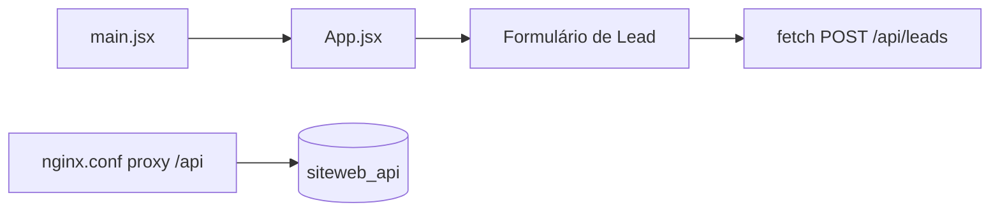

Responsabilidades
- `index.html`: container da SPA.
- `main.jsx`: bootstrap da aplicação.
- `App.jsx`: UI principal e handlers do formulário.
- `nginx.conf`: serve estáticos e proxy `/api/*` para a API.