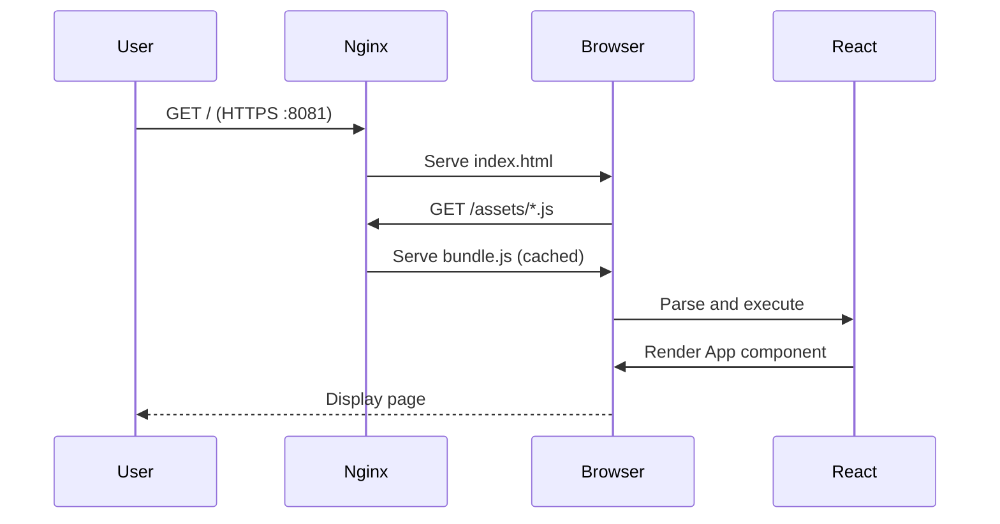
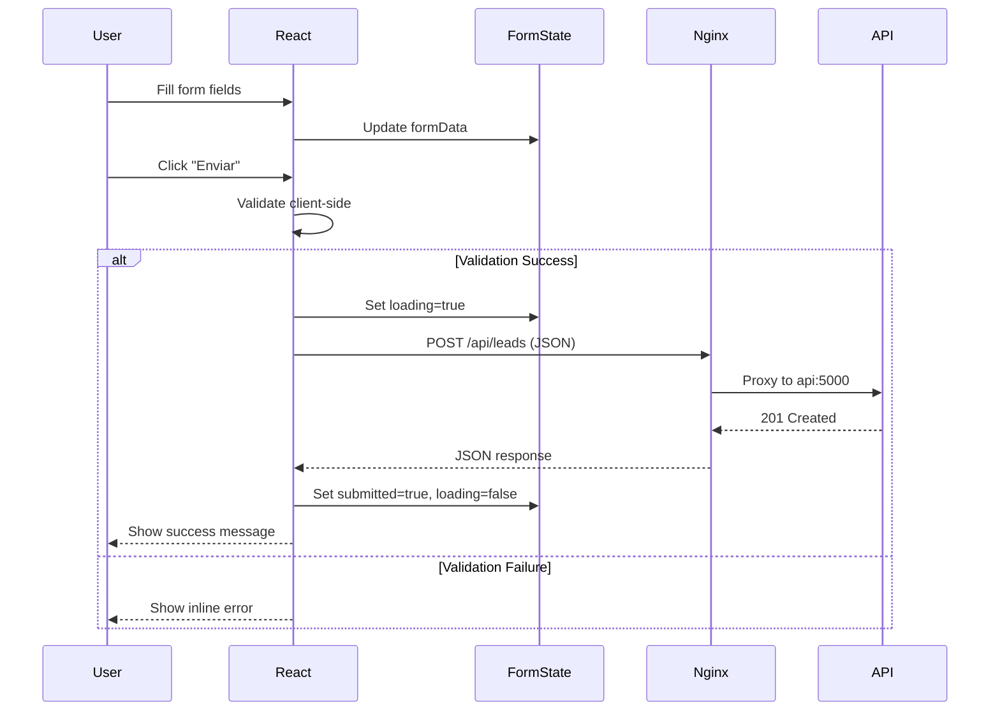

# C4 Model - Nível 3: Components - UI

> **Audiência**: Desenvolvedores, Arquitetos de Software  
> **Objetivo**: Estrutura interna do container siteweb_ui (componentes React e Nginx)  
> **Última revisão**: 2025-01-15

---

## 📊 Diagrama de Componentes

```mermaid
flowchart TB
    subgraph External["🌐 Sistemas Externos"]
        User[Browser<br/>User Agent]
        APIHTTP[API Backend<br/>api:5000]
    end
    
    subgraph UI["🌐 siteweb_ui Container"]
        subgraph WebServer["🔧 Nginx Web Server"]
            NginxCore[Nginx Core<br/>Static file server<br/>Port :80]
            ProxyModule[Proxy Module<br/>Reverse proxy<br/>/api/* routing]
        end
        
        subgraph ReactApp["📱 React Application"]
            Main[Main Entry<br/>main.jsx<br/>Bootstrap]
            App[App Component<br/>App.jsx<br/>Root component]
            FormSection[Form Section<br/>Lead form UI<br/>Validation]
            ContentSections[Content Sections<br/>Hero, Features<br/>About DevOps]
        end
        
        subgraph StateManagement["💾 State Management"]
            FormState[Form State<br/>useState hooks<br/>nome, email, area]
            UIState[UI State<br/>loading, error<br/>submitted flags]
        end
        
        subgraph Styling["🎨 Styling System"]
            GlobalCSS[Global Styles<br/>index.css<br/>Base theme]
            AppCSS[Component Styles<br/>App.css<br/>Form, sections]
        end
    end
    
    User -->|"HTTPS :8081"| NginxCore
    NginxCore -->|"Serve bundle.js"| Main
    Main --> App
    App --> ContentSections
    App --> FormSection
    FormSection --> FormState
    FormSection --> UIState
    FormSection -.->|"POST /api/leads"| ProxyModule
    ProxyModule -->|"Proxy to api:5000"| APIHTTP
    GlobalCSS -.-> App
    AppCSS -.-> FormSection
    AppCSS -.-> ContentSections
    
    classDef external fill:#FFB6C1,stroke:#DC143C,color:#1a1a1a
    classDef webserver fill:#F0E68C,stroke:#DAA520,color:#1a1a1a
    classDef react fill:#87CEEB,stroke:#4682B4,color:#1a1a1a
    classDef state fill:#98FB98,stroke:#32CD32,color:#1a1a1a
    classDef style fill:#DDA0DD,stroke:#9370DB,color:#1a1a1a
    
    class User,APIHTTP external
    class NginxCore,ProxyModule webserver
    class Main,App,FormSection,ContentSections react
    class FormState,UIState state
    class GlobalCSS,AppCSS style
```

---

## 🧩 Descrição dos Componentes

### 🔧 **Nginx Web Server**

#### **Nginx Core**
- **Tipo**: Web Server
- **Responsabilidades**:
  - ✅ Servir arquivos estáticos (HTML, JS, CSS, assets)
  - ✅ Compressão gzip de responses
  - ✅ Cache de assets estáticos
  - ✅ Roteamento SPA (fallback para index.html)
- **Configuração Principal**:
  ```nginx
  server {
    listen 80;
    root /usr/share/nginx/html;
    index index.html;
    
    location / {
      try_files $uri /index.html;  # SPA routing
    }
  }
  ```
- **Performance**:
  - Cache-Control headers para assets (1 ano)
  - ETag para validação de cache
  - Compressão gzip level 6
- **Código Referência**: `SiteWebUI/nginx.conf`

#### **Proxy Module**
- **Tipo**: Reverse Proxy
- **Responsabilidades**:
  - ✅ Rotear requisições `/api/*` para backend
  - ✅ Adicionar headers de proxy
  - ✅ Manter keep-alive de conexões
  - 🚧 Load balancing (quando múltiplas instâncias API)
- **Configuração de Proxy**:
  ```nginx
  location /api/ {
    proxy_pass http://api:5000;
    proxy_set_header Host $host;
    proxy_set_header X-Real-IP $remote_addr;
    proxy_set_header X-Forwarded-For $proxy_add_x_forwarded_for;
    proxy_set_header X-Forwarded-Proto $scheme;
    proxy_http_version 1.1;
    proxy_set_header Connection "";
  }
  ```
- **Timeout Configuration**:
  - `proxy_connect_timeout: 10s`
  - `proxy_send_timeout: 30s`
  - `proxy_read_timeout: 30s`

---

### 📱 **React Application**

#### **Main Entry (main.jsx)**
- **Tipo**: Entry Point
- **Responsabilidades**:
  - ✅ Bootstrap da aplicação React
  - ✅ Renderizar App component no DOM
  - ✅ Importar estilos globais
  - 🚧 Configurar providers (React Query, Router - futuros)
- **Código**:
  ```jsx
  import React from 'react'
  import ReactDOM from 'react-dom/client'
  import App from './App.jsx'
  import './index.css'
  
  ReactDOM.createRoot(document.getElementById('root')).render(
    <React.StrictMode>
      <App />
    </React.StrictMode>,
  )
  ```
- **Código Referência**: `SiteWebUI/src/main.jsx`

#### **App Component (App.jsx)**
- **Tipo**: Root Component
- **Responsabilidades**:
  - ✅ Estrutura principal da aplicação
  - ✅ Gerenciar estado do formulário
  - ✅ Coordenar seções de conteúdo
  - ✅ Tratar erros e loading states
- **Props**: Nenhuma (root component)
- **State**:
  - `formData` (objeto com nome, email, area, comentario)
  - `submitted` (boolean)
  - `errorMsg` (string)
  - `loading` (boolean)
- **Hooks Utilizados**:
  - `useState` para gerenciamento de estado local
- **Código Referência**: `SiteWebUI/src/App.jsx`

#### **Form Section**
- **Tipo**: Functional Component (inline em App.jsx)
- **Responsabilidades**:
  - ✅ Renderizar formulário de captura de leads
  - ✅ Validação client-side (campos obrigatórios)
  - ✅ Enviar dados via POST /api/leads
  - ✅ Exibir feedback visual (loading, success, error)
- **Campos do Formulário**:
  - Nome (text, required)
  - Email (email, required)
  - Área (select, required) - desenvolvimento, devops, qa, infra, outro
  - Comentário (textarea, optional)
- **Validações Client-Side**:
  - ✅ HTML5 validation (required, type="email")
  - 🚧 Custom validation (min length, max length)
- **Acessibilidade**:
  - ✅ Labels associados via `htmlFor`
  - ✅ Placeholders descritivos
  - ✅ Role `status` para mensagens de sucesso
  - 🚧 ARIA labels para erros
  - 🚧 Focus management

#### **Content Sections**
- **Tipo**: Functional Components (inline em App.jsx)
- **Seções**:
  1. **Hero Section**: Título principal e subtítulo
  2. **O que é DevOps**: Explicação conceitual
  3. **Ferramentas**: Lista de tecnologias comuns
  4. **DevOps x Desenvolvedores**: Comparação de papéis
  5. **Footer**: Copyright e links
- **Responsabilidades**:
  - ✅ Apresentar conteúdo educacional
  - ✅ Estruturação semântica (header, section, footer)
  - ✅ Estilização consistente

---

### 💾 **State Management**

#### **Form State**
- **Tipo**: React State (useState)
- **Estrutura**:
  ```javascript
  const [formData, setFormData] = useState({
    nome: '',
    email: '',
    area: '',
    comentario: ''
  })
  ```
- **Handlers**:
  - `handleChange`: Atualiza campo específico
  - `handleSubmit`: Envia dados para API
- **Validação**:
  - Client-side via HTML5 attributes
  - Server-side validation é definitiva

#### **UI State**
- **Tipo**: React State (useState)
- **Estados Gerenciados**:
  ```javascript
  const [submitted, setSubmitted] = useState(false)
  const [errorMsg, setErrorMsg] = useState('')
  const [loading, setLoading] = useState(false)
  ```
- **Fluxo de Estados**:
  1. Initial: `loading=false, submitted=false, errorMsg=''`
  2. Submitting: `loading=true`
  3. Success: `submitted=true, loading=false`
  4. Error: `errorMsg='...', loading=false`

---

### 🎨 **Styling System**

#### **Global Styles (index.css)**
- **Tipo**: CSS Module
- **Responsabilidades**:
  - ✅ Reset CSS básico
  - ✅ Variáveis de cor (CSS Custom Properties)
  - ✅ Tipografia base
  - ✅ Estilos de elementos HTML (body, button, a)
- **Tema de Cores**:
  ```css
  :root {
    --bg: #0f172a;
    --card: #0b1222;
    --text: #e2e8f0;
    --muted: #94a3b8;
    --primary: #646cff;
    --accent: #22d3ee;
  }
  ```
- **Responsividade**: Media queries para temas light/dark
- **Código Referência**: `SiteWebUI/src/index.css`

#### **Component Styles (App.css)**
- **Tipo**: CSS Module
- **Responsabilidades**:
  - ✅ Estilos específicos da App
  - ✅ Layout de seções (.hero, .section, .form)
  - ✅ Estilos de formulário (.field, .submit)
  - ✅ Estados visuais (hover, focus, disabled)
- **Classes Principais**:
  - `.home`: Container principal
  - `.hero`: Header com título
  - `.section`: Card de conteúdo
  - `.form`: Grid de campos
  - `.submit`: Botão de envio
  - `.success`: Mensagem de feedback
- **Código Referência**: `SiteWebUI/src/App.css`

---

## 🔄 Fluxos de Interação

### Fluxo 1: Load Inicial da Página



### Fluxo 2: Submissão de Formulário



---

## 🎨 Design System

### Tipografia
- **Font Family**: `system-ui, Avenir, Helvetica, Arial, sans-serif`
- **Tamanhos**:
  - H1: 2rem (hero)
  - H2: 1.25rem (sections)
  - Body: 1rem (14px base)

### Espaçamento
- **Padding Sections**: 1.25rem
- **Margin Between Sections**: 1rem
- **Gap Form**: 1rem
- **Gap Fields**: 0.5rem

### Cores e Contraste
- ✅ Contraste adequado para WCAG AA
- Background escuro com texto claro
- Primary color: `#646cff` (azul vibrante)
- Success: Verde menta `#1bbf58`
- Error: Vermelho suave (planejado)

---

## 🔒 Segurança

### Content Security Policy (Planejado)
```nginx
add_header Content-Security-Policy "default-src 'self'; script-src 'self' 'unsafe-inline'; style-src 'self' 'unsafe-inline';" always;
```

### XSS Protection
- ✅ React escapa automaticamente valores em JSX
- ✅ Não usa `dangerouslySetInnerHTML`
- 🚧 Sanitização adicional para inputs (DOMPurify - planejado)

### HTTPS
- 🚧 TLS 1.3 em produção
- 🚧 HSTS header configurado
- 🚧 Redirecionamento automático HTTP → HTTPS

---

## 📈 Performance

### Bundle Size
- **Atual**: ~150KB (gzipped)
- **Target**: < 200KB
- **Análise**: `npm run build -- --analyze` (planejado)

### Optimizações Implementadas
- ✅ Vite code splitting automático
- ✅ Tree shaking de imports
- ✅ Minificação de JS/CSS
- ✅ Compressão gzip no Nginx

### Core Web Vitals (Target)
- **LCP (Largest Contentful Paint)**: < 2.5s
- **FID (First Input Delay)**: < 100ms
- **CLS (Cumulative Layout Shift)**: < 0.1

### Otimizações Planejadas
- 🚧 Lazy loading de seções não críticas
- 🚧 Image optimization (WebP, lazy loading)
- 🚧 Font preloading
- 🚧 Service Worker para cache offline

---

## ♿ Acessibilidade

### WCAG 2.1 Compliance
- ✅ **Level A**: Atendido
- 🚧 **Level AA**: Em progresso
- 🚧 **Level AAA**: Planejado

### Implementações
- ✅ Landmarks semânticos (header, main, section, footer)
- ✅ Labels associados a inputs
- ✅ Alt text em imagens (quando houver)
- 🚧 Navegação por teclado completa
- 🚧 Focus visible em todos os interativos
- 🚧 ARIA labels para estados dinâmicos
- 🚧 Screen reader testing

---

## 🧪 Testabilidade

### Testes Planejados

#### Unit Tests (Vitest)
```javascript
describe('Form validation', () => {
  it('should validate required fields', () => {
    // Test logic
  });
});
```

#### Integration Tests (React Testing Library)
```javascript
describe('Lead form submission', () => {
  it('should submit form successfully', async () => {
    render(<App />);
    // Fill form
    // Submit
    // Assert success message
  });
});
```

#### E2E Tests (Playwright)
```javascript
test('complete lead capture flow', async ({ page }) => {
  await page.goto('http://localhost:8081');
  await page.fill('#nome', 'Test User');
  // ...
  await page.click('.submit');
  await expect(page.locator('.success')).toBeVisible();
});
```

---

## 📦 Build e Deploy

### Build Process
```bash
cd SiteWebUI
npm ci                    # Install dependencies
npm run build            # Vite build → dist/
docker build -t ui .     # Multi-stage: build + nginx
```

### Build Output
```
dist/
├── index.html           # Entry point
├── assets/
│   ├── index-[hash].js  # Main bundle
│   ├── index-[hash].css # Styles
│   └── *.svg           # Assets
└── vite.svg            # Favicon
```

### Environment-Specific Config
| Environment | API Base URL | Build Mode |
|-------------|-------------|------------|
| Development | `http://localhost:5000` | development |
| Staging     | `https://api.staging.siteweb.com` | production |
| Production  | `https://api.siteweb.com` | production |

---

## 🔄 Histórico de Mudanças

| Versão | Data | Autor | Mudanças |
|--------|------|-------|----------|
| v2.0 | 2025-01-15 | Equipe Alest | Reescrita completa seguindo Global Rules v12.0 (Seção 4.1.3); adicionados diagramas de fluxo, performance targets e accessibility guidelines |
| v1.0 | 2025-11-12 | Equipe Alest | Versão inicial do diagrama de componentes UI |

---

## 📚 Referências

### Documentação Relacionada
- [C4 Level 2 - Containers](/architecture/c4-model/02-containers/siteweb-containers-v2.md)
- [C4 Level 3 - API Components](/architecture/c4-model/03-components/siteweb-api-components-v2.md)
- [ADR-0001: Escolha de Stack React](/architecture/adr/0001-stack-node-react.md)
- [Design System (Planejado)](#)

### Código Relacionado
- `SiteWebUI/src/main.jsx` - Entry point
- `SiteWebUI/src/App.jsx` - Root component
- `SiteWebUI/src/*.css` - Styling
- `SiteWebUI/nginx.conf` - Web server config
- `SiteWebUI/vite.config.js` - Build configuration

### Padrões e Guidelines
- [React Documentation](https://react.dev/)
- [Vite Guide](https://vitejs.dev/guide/)
- [Nginx Best Practices](https://www.nginx.com/blog/nginx-best-practices/)
- [WCAG 2.1 Guidelines](https://www.w3.org/WAI/WCAG21/quickref/)
- [Global Rules v12.0 - Seção 4.1.3 (C4 Components)](../../GLOBAL_RULES.md#413-c4-components)
- [Global Rules v12.0 - Seção 10 (Frontend Padrões)](../../GLOBAL_RULES.md#10-frontend-padrões-gerais)

---

## 🤝 Responsabilidades

### Ownership
- **Owner**: Desenvolvedores Sênior da equipe Frontend
- **Frequência de Revisão**: A cada sprint ou mudança significativa de UI
- **Critérios de Atualização**: 
  - Novos componentes React adicionados
  - Mudanças na arquitetura de estado
  - Refatorações de estilos ou layout

### Aprovação de Mudanças
- Mudanças neste diagrama requerem aprovação de:
  - ✅ Tech Lead Frontend (validação técnica)
  - ✅ UX/UI Designer (validação de experiência)
  - ✅ Code Review de Senior Developer
  - ✅ Testes de acessibilidade (quando implementados)

---

**📌 Nota**: Este diagrama segue as convenções da **Seção 4.1.3 (C4 Components)** e **Seção 10 (Frontend Padrões)** das Global Rules v12.0.

