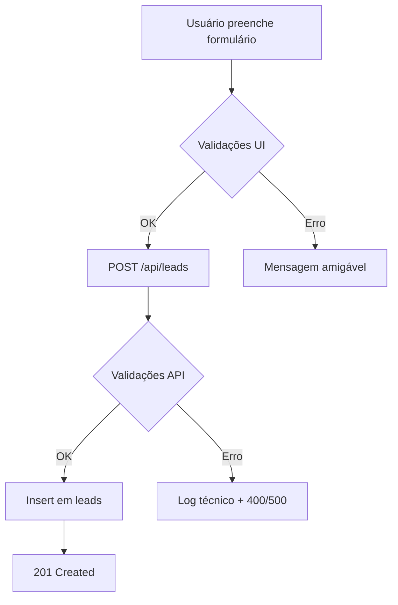

```mermaid
flowchart TD
  A[Usuário preenche formulário] --> B{Validações UI}
  B -->|OK| C[POST /api/leads]
  C --> D{Validações API}
  D -->|OK| E[Insert em leads]
  E --> F[201 Created]
  B -->|Erro| G[Mensagem amigável]
  D -->|Erro| H[Log técnico + 400/500]
```

Validações
- Nome obrigatório; e-mail em formato válido.
- Área informada; comentário opcional.
- E-mail único (índice) – tratar conflito com mensagem clara.