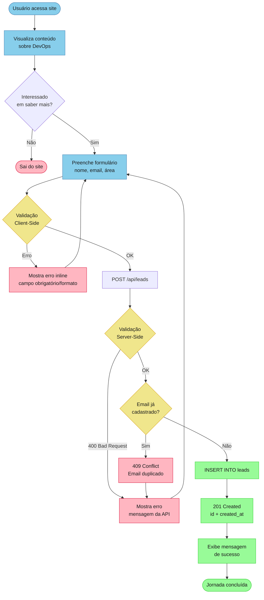

# Fluxo de Negócio – Cadastro de Leads

> Jornada completa do usuário desde visualização do conteúdo até confirmação de cadastro

---

## 📊 Diagrama de Fluxo Principal



---

## 🎯 Etapas Detalhadas

### 1️⃣ Visualização de Conteúdo
**Ator**: Usuário (Visitante)  
**Objetivo**: Entender o que é DevOps  

**Conteúdo Apresentado**:
- Hero: Título principal e subtítulo
- O que é DevOps: Explicação conceitual
- Ferramentas comuns: Lista de tecnologias (CI/CD, containers, cloud)
- DevOps vs Desenvolvedores: Comparação de papéis

**Resultado Esperado**: Usuário compreende o valor de DevOps e deseja saber mais

---

### 2️⃣ Preenchimento do Formulário
**Ator**: Usuário (Interessado)  
**Objetivo**: Enviar dados de contato  

**Campos do Formulário**:
| Campo | Tipo | Obrigatório | Validação |
|-------|------|-------------|-----------|
| Nome | text | ✅ | HTML5 `required` |
| Email | email | ✅ | HTML5 `type="email"` |
| Área | select | ✅ | HTML5 `required` |
| Comentário | textarea | ❌ | - |

**Opções de Área**:
- desenvolvimento
- devops
- qa
- infra
- outro

---

### 3️⃣ Validação Client-Side
**Responsável**: React (Frontend)  
**Objetivo**: Feedback rápido ao usuário  

**Validações HTML5**:
- ✅ Campos obrigatórios preenchidos
- ✅ Email em formato válido (regex browser)
- ✅ Área selecionada

**Estados Visuais**:
- ❌ **Erro**: Border vermelho + mensagem inline
- ✅ **Sucesso**: Border verde (opcional)
- ⏳ **Loading**: Botão desabilitado + "Enviando..."

---

### 4️⃣ Submissão para API
**Responsável**: React → Express  
**Método**: `POST /api/leads`  

**Request Payload**:
```json
{
  "nome": "João Silva",
  "email": "joao.silva@example.com",
  "area": "desenvolvimento",
  "comentario": "Gostaria de aprender sobre CI/CD"
}
```

**Headers**:
- `Content-Type: application/json`
- `Accept: application/json`

---

### 5️⃣ Validação Server-Side
**Responsável**: Express (Backend)  
**Objetivo**: Segurança e integridade de dados  

**Validações**:
```javascript
// Campos obrigatórios
if (!nome || !email || !area) {
  return 400 "Campos obrigatórios: nome, email, area"
}

// Formato de email
if (!/^[^\s@]+@[^\s@]+\.[^\s@]+$/.test(email)) {
  return 400 "Email inválido"
}

// Sanitização (implícita via pg parametrizado)
```

**Códigos de Resposta**:
- `400 Bad Request`: Validação falhou
- `409 Conflict`: Email duplicado (planejado)
- `500 Internal Server Error`: Erro de banco

---

### 6️⃣ Verificação de Duplicidade
**Responsável**: PostgreSQL  
**Objetivo**: Email único por lead  

**Query Atual** (sem verificação explícita):
```sql
INSERT INTO leads (nome, email, area, comentario)
VALUES ($1, $2, $3, $4)
RETURNING id, created_at;
```

**Comportamento**:
- ✅ **Sucesso**: Lead cadastrado
- ❌ **Duplicate key**: PostgreSQL error 23505 (não tratado ainda)

**Planejado (Q1 2025)**:
```sql
-- Adicionar constraint UNIQUE
ALTER TABLE leads ADD CONSTRAINT unique_email UNIQUE (email);

-- Verificar antes de inserir
SELECT id FROM leads WHERE email = $1;
```

---

### 7️⃣ Persistência no Banco
**Responsável**: PostgreSQL  
**Objetivo**: Armazenar lead permanentemente  

**Dados Salvos**:
- `id`: Auto-incremental (SERIAL)
- `nome`: Exatamente como enviado
- `email`: Lowercase normalizado (planejado)
- `area`: Exatamente como enviado
- `comentario`: Null se não informado
- `created_at`: Timestamp automático (UTC)

**Índices**:
- Primary Key: `id`
- Index: `email` (para busca rápida)

---

### 8️⃣ Resposta de Sucesso
**Responsável**: Express → React  
**Status**: `201 Created`  

**Response Payload**:
```json
{
  "ok": true,
  "id": 123,
  "created_at": "2025-01-15T10:30:00.000Z"
}
```

---

### 9️⃣ Feedback Visual
**Responsável**: React  
**Objetivo**: Confirmar cadastro ao usuário  

**Mensagem de Sucesso**:
```
✅ Obrigado! Em breve entraremos em contato.
```

**Estado da UI**:
- ✅ Formulário oculto
- ✅ Mensagem de sucesso visível (fundo verde)
- ✅ Botão "Enviar" desabilitado (prevent double-submit)

---

## ⚠️ Tratamento de Erros

### Erro 400: Bad Request
**Causa**: Validação falhou (campos obrigatórios ou email inválido)  
**Resposta API**:
```json
{
  "error": "Campos obrigatórios: nome, email, area."
}
```
**UI**: Mensagem de erro em banner vermelho acima do formulário

---

### Erro 500: Internal Server Error
**Causa**: Falha no banco de dados ou erro não previsto  
**Resposta API**:
```json
{
  "error": "Erro interno ao salvar dados."
}
```
**UI**: Mensagem genérica + sugere tentar novamente  
**Logging**: Stack trace completo no servidor (planejado: Winston)

---

### Erro 409: Conflict (Planejado)
**Causa**: Email já cadastrado  
**Resposta API**:
```json
{
  "error": "Este email já está cadastrado."
}
```
**UI**: Mensagem específica + link para "Recuperar dados" (futuro)

---

## 📊 Métricas de Sucesso

### Funnel de Conversão
```
100% Visualizações de página
 └─> 60% Scroll até formulário
     └─> 30% Começam a preencher
         └─> 15% Submetem formulário
             └─> 90% Sucesso (10% erro validação)
```

### KPIs
- **Taxa de Conversão**: 15% (visitantes → leads)
- **Taxa de Sucesso**: 90% (submissões → leads salvos)
- **Tempo Médio de Preenchimento**: ~45s

---

## 🔄 Fluxos Alternativos

### Fluxo Alt-1: Usuário Desiste
```
Visualiza conteúdo → Scroll para baixo → Sai do site
```
**Mitigação**: Melhorar copy, adicionar social proof

---

### Fluxo Alt-2: Erro de Rede
```
Submete formulário → Timeout/Network Error → Retry automático (planejado)
```
**Mitigação**: Implementar retry logic com exponential backoff

---

## 🚀 Melhorias Planejadas (Q1-Q2 2025)

### Q1 2025
- [ ] Verificação de duplicidade de email (409 Conflict)
- [ ] Normalização de email (lowercase, trim)
- [ ] Analytics de abandono de formulário
- [ ] Loading states mais visuais

### Q2 2025
- [ ] Confirmação por email (double opt-in)
- [ ] CAPTCHA após 3 submissões rápidas
- [ ] Enriquecimento de dados (integração com APIs de perfil)
- [ ] Sincronização automática com CRM

---

## 📚 Referências

- [PRD - User Stories](../architecture/steering/PRD.md#user-stories)
- [C4 API Components](../architecture/c4-model/03-components/siteweb-api-components-v2.md)
- [C4 UI Components](../architecture/c4-model/03-components/siteweb-ui-components-v2.md)
- [Business Rules - Leads](../business-rules/leads-v2.md)

---

**Última Atualização**: 2025-01-15 | **Aprovado por**: Product Owner

